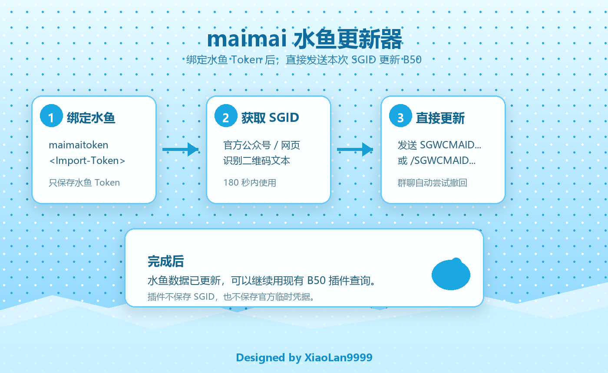

# AstrBot maimai 水鱼更新器

这是一个 AstrBot 插件，用舞萌 DX 官方二维码识别文本 `SGWCMAID...` 和水鱼 Import-Token，把成绩同步到水鱼查分器。



## 更新日志

### v0.6.15

- 优先接入独立接口层，统一 SGID 会话、完整成绩和后续扩展能力；未启用时保留内置链路兜底。

### v0.6.14

- 按官包真实联网流程接入标题服：先请求 `GetGameSettingApi` 获取运行时入口，再读取 `GetUserMusicApi`。
- 水鱼更新改为使用 `GetUserMusicApi` 的 `comboStatus` / `syncStatus` 写入 FC、FC+、AP、AP+、FS、FS+、FSD、FSD+、SYNC。
- Rating 优先使用 `GetUserDataApi` 返回的当前版本 `playerRating` / `musicRating`，避免继续显示旧版本 Rating。

### v0.6.13

- 停用 v0.6.12 中基于 `maimai_ffi.arcade` 原始成绩补 FC/FS/AP 的错误路径：该数据源实际只返回基础成绩，不包含完整标识字段。
- 确认完整标识应来自官包标题服 `GetUserMusicApi` 返回的 `comboStatus` / `syncStatus`。
- 暂停内置静态标题服地址猜测，后续改为按官包启动链路解析标题服入口。
- 修正插件注册版本与市场元数据版本不一致的问题。

### v0.6.12

- 尝试直接读取一次性 SGID 对应的原始成绩数据以保留 FC、FS、AP 等特殊标识。
- Rating 改为使用当前 maimai.py 曲库版本在本地重新计算。

### v0.6.5 - v0.6.11

- 调整一次性 SGID 会话解析和官方完整成绩链路。
- 收敛面板配置项，普通使用只保留水鱼 Token 和 SGID 更新流程。

## 功能

- `maimaitoken <Import-Token>` / `水鱼绑定 <Import-Token>` / `绑定水鱼 <Import-Token>`：保存水鱼 Import-Token。
- `maimaiupdate <SGID>` / `更新水鱼 <SGID>` / `水鱼更新 <SGID>` / `更新b50 <SGID>`：用本次 SGID 更新水鱼成绩。
- `maimaiclear 确认清空` / `清空水鱼 确认清空` / `清空b50 确认清空`：向水鱼发送清空成绩请求。
- `maimaistatus` / `水鱼状态`：查看绑定状态、最近同步结果和命令触发方式。
- `maimaiunbind` / `水鱼解绑`：删除当前用户保存的水鱼 Token 和本地状态。

插件不提供 `maimai_bind`。每次更新都直接发送一次更新命令和本次 SGID。

## 命令触发

默认开启 `require_command_prefix`，插件只响应 AstrBot 标准命令触发。实际前缀取决于 Bot 配置，例如：

```text
/水鱼状态
/水鱼绑定 <Import-Token>
/更新水鱼 SGWCMAID...
```

如果在面板关闭 `require_command_prefix`，本插件命令可以不带 Bot 唤醒前缀直接发送：

```text
水鱼状态
水鱼绑定 <Import-Token>
绑定水鱼 <Import-Token>
更新水鱼 SGWCMAID...
水鱼更新 SGWCMAID...
清空b50 确认清空
水鱼解绑
```

裸 `SGWCMAID...` 不会触发更新。

## 当前数据链路

稳定可用的 maimai.py ArcadeProvider 链路只能提供基础成绩；它不会返回 FC、FS、AP 等特殊标识。

官包内完整成绩字段位于标题服 `GetUserMusicApi` 响应中：

- `comboStatus`：FC / FC+ / AP / AP+
- `syncStatus`：FS / FS+ / FSD / FSD+ / SYNC

插件会按官包实际启动链路解析标题服入口，而不是使用旧的基础成绩链路补全标识。

## 运行环境

- Python `>=3.9,<4.0`
- AstrBot `>=4.5.2`
- 依赖见 `requirements.txt`

如果依赖安装失败，完整关闭 AstrBot Launcher 和相关 Python 进程后重新安装插件依赖。
