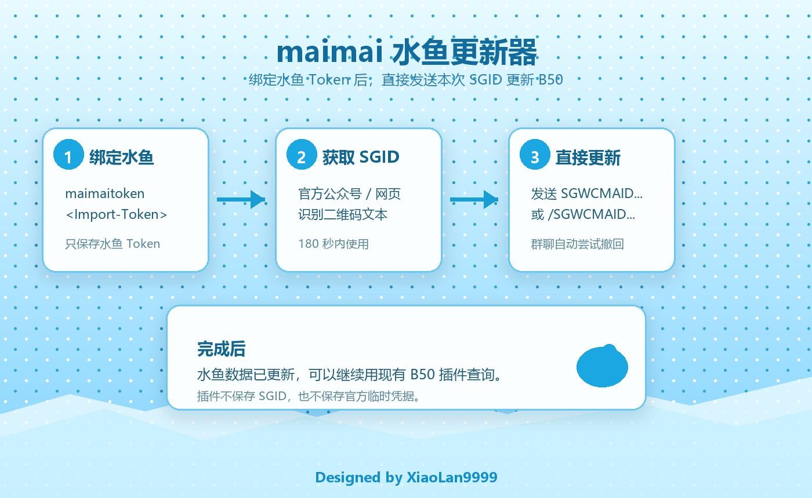

# AstrBot maimai 水鱼更新器

这是一个 AstrBot 插件，用舞萌 DX 官方二维码识别文本 `SGWCMAID...` 和水鱼 Import-Token，把成绩同步到水鱼查分器。



## 更新日志

见 [CHANGELOG.md](CHANGELOG.md)。

## 功能

- `maimaitoken <Import-Token>` / `水鱼绑定 <Import-Token>` / `绑定水鱼 <Import-Token>`：保存水鱼 Import-Token。
- `maimaiupdate <SGID>` / `更新水鱼 <SGID>` / `水鱼更新 <SGID>` / `更新b50 <SGID>`：用本次 SGID 更新水鱼成绩。
- `maimaiclear 确认清空` / `清空水鱼 确认清空` / `清空b50 确认清空`：向水鱼发送清空成绩请求。
- `maimaistatus` / `水鱼状态`：查看绑定状态、最近同步结果和命令触发方式。
- `maimaiunbind` / `水鱼解绑`：删除当前用户保存的水鱼 Token 和本地状态。

插件不提供 `maimai_bind`。每次更新都直接发送一次更新命令和本次 SGID。

## 命令触发

默认开启 `require_command_prefix`，插件只响应 AstrBot 标准命令触发。实际前缀取决于 Bot 配置，例如：

```text
/水鱼状态
/水鱼绑定 <Import-Token>
/更新水鱼 SGWCMAID...
```

如果在面板关闭 `require_command_prefix`，本插件命令可以不带 Bot 唤醒前缀直接发送：

```text
水鱼状态
水鱼绑定 <Import-Token>
绑定水鱼 <Import-Token>
更新水鱼 SGWCMAID...
水鱼更新 SGWCMAID...
清空b50 确认清空
水鱼解绑
```

裸 `SGWCMAID...` 不会触发更新。

## 当前数据链路

插件会通过本次 SGID 读取完整官方成绩字段，并写入水鱼 Import-Token 对应账号。

更新后的水鱼数据会保留 FC / FS / AP / SYNC 等特殊标识；不会用基础成绩链路猜测或补全这些标识。

## 运行环境

- Python `>=3.9,<4.0`
- AstrBot `>=4.5.2`
- 依赖见 `requirements.txt`

如果依赖安装失败，完整关闭 AstrBot Launcher 和相关 Python 进程后重新安装插件依赖。
